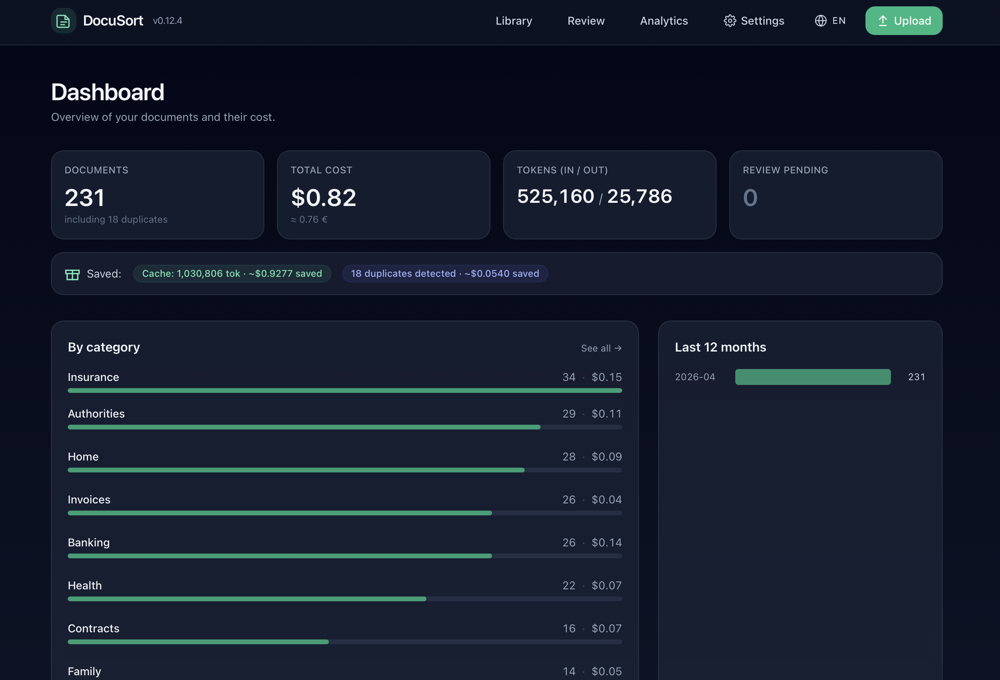
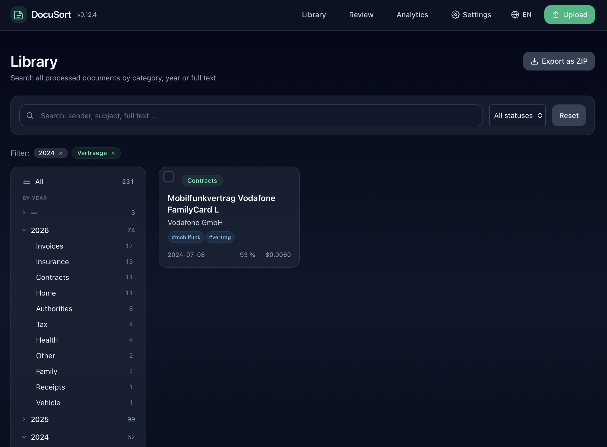
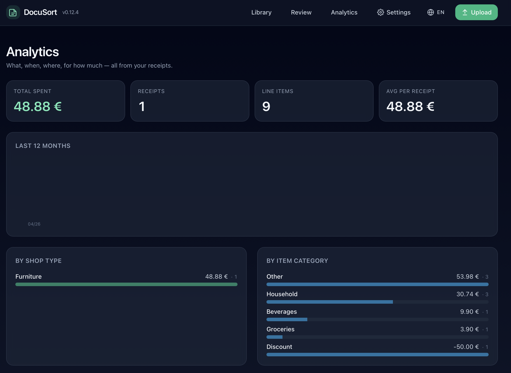
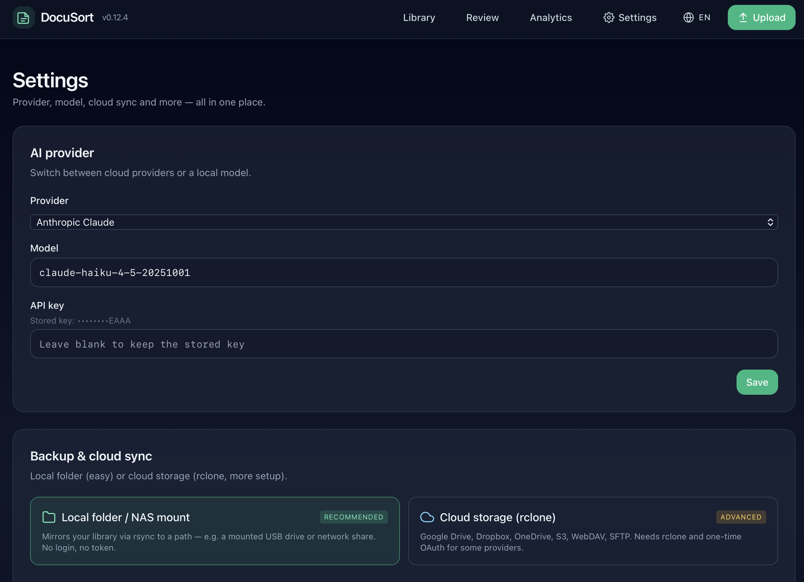
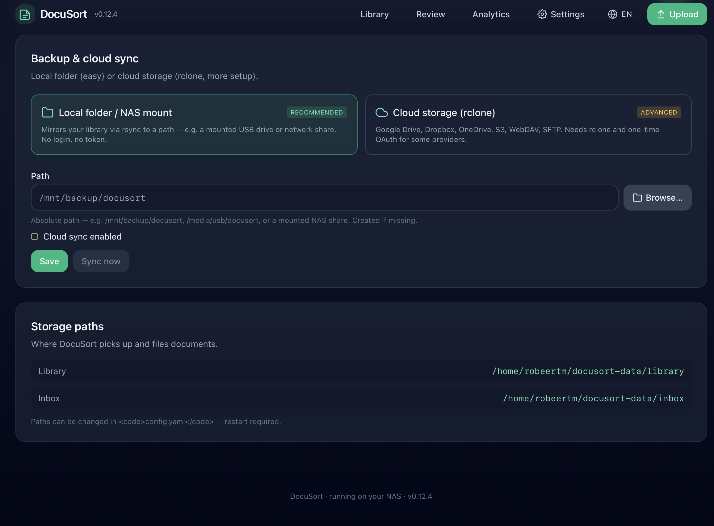

# DocuSort

**AI-powered, self-hosted document organizer with OCR, receipt scanning, and analytics.**
Upload a scan from your desktop or phone and — a few seconds later — it is
renamed, dated, filed into the right category, and browsable in a clean,
mobile-friendly interface. Receipts are auto-detected and broken down into
structured line items so you can see where your money actually goes.

Built for a Synology NAS in Docker, but runs anywhere Docker (or just
plain Python) runs. Pick your AI: Anthropic Claude, OpenAI GPT, Google
Gemini, or run a local model via Ollama — your documents never have to
leave your network.



<table>
  <tr>
    <td width="50%"><a href="docs/screenshots/02-library.png"></a></td>
    <td width="50%"><a href="docs/screenshots/03-analytics.png"></a></td>
  </tr>
  <tr>
    <td><sub><b>Library</b> — year tree, full-text search across OCR text, tag filters, ZIP export of any selection.</sub></td>
    <td><sub><b>Analytics</b> — receipts auto-extracted into line items: total spent, by shop type, by item category, top items, monthly trend.</sub></td>
  </tr>
  <tr>
    <td><a href="docs/screenshots/04-settings.png"></a></td>
    <td><a href="docs/screenshots/05-backup.png"></a></td>
  </tr>
  <tr>
    <td><sub><b>Settings</b> — switch AI providers (Anthropic / OpenAI / Gemini / Ollama) without losing keys, configure backup target.</sub></td>
    <td><sub><b>Backup</b> — local rsync to a USB stick / NAS share (zero auth) or cloud via rclone with a headless OAuth-token-paste flow.</sub></td>
  </tr>
</table>

- **Web UI** on a port you pick (default 8080, configurable in the wizard
  and in `/settings`) — dashboard, library browser with full-text search,
  per-document detail + PDF preview, mobile upload with camera capture
- **First-run setup wizard** at `/setup` — pick language, AI provider, paste
  token, optionally configure backup. Always-reachable settings page at `/settings`
- **Multi-provider AI**: Anthropic Claude · OpenAI GPT · Google Gemini · or any
  OpenAI-compatible endpoint (Ollama, Groq, xAI, Mistral, OpenRouter …) for
  fully local classification
- **Subcategories + free-form tags** — files land at
  `Library/YYYY/Category/Subcategory/` and carry up to 8 lowercase labels
- **Receipt scanner + analytics** — Kassenzettel are recognised
  automatically. A second-pass LLM extracts shop name + type, payment
  method, total, and per-line items with prices and item categories.
  Browse aggregated spend per month, by shop type and item category,
  search line items, see your most-bought items at `/analytics`.
- **OCR** for scanned PDFs and images (Tesseract `deu+eng`)
- **Backup** to a local folder (rsync, no setup) or to the cloud via rclone
  (Drive · Dropbox · OneDrive · S3 · WebDAV · SFTP). Headless-friendly:
  no browser needed on the host.
- **Cost tracking** per document + aggregated (tokens in/out, USD and EUR preview),
  with prompt-caching factored in for Anthropic and OpenAI
- **Low-confidence review folder** instead of wrong guesses, full metadata
  editing on the document detail page
- **Trash + restore + permanent purge**, ZIP export of any filtered selection
- **Safety copy** of every original kept in `_Processed/`
- **i18n**: German · English · French · Italian · Spanish

## File naming

Every filed document follows the same pattern:

```
YYYY-MM-DD_Category_Sender_Subject.pdf
```

Examples:

```
2026-02-14_Rechnungen_Vodafone_Mobilfunk-Februar.pdf
2026-01-03_Gesundheit_Hausarzt-Dr-Mueller_Blutbild.pdf
2026-03-20_Steuer_Finanzamt-Dresden_Bescheid-2024.pdf
```

The template is configurable in `config/config.yaml`.

## Folder layout

```
/data/
├── inbox/                    ← drop scans here
└── library/
    ├── 2026/
    │   ├── Rechnungen/
    │   ├── Vertraege/
    │   ├── Behoerde/
    │   ├── Gesundheit/
    │   ├── Gehalt/
    │   ├── Steuer/
    │   ├── Haus/
    │   ├── Versicherung/
    │   ├── Bank/
    │   └── Sonstiges/
    ├── _Review/              ← uncertain docs land here for manual sorting
    └── _Processed/           ← copy of every original file
```

## Requirements

- Docker and docker-compose (Synology: install "Container Manager" from Package
  Center, DSM 7.2+) — or run directly on Linux/macOS via the launchers below
- A folder on your NAS where scans arrive (e.g. `/volume1/Scan`)
- A folder that will become your library (e.g. `/volume1/Dokumente`)
- **An API key for one** of:
  - Anthropic Claude (`ANTHROPIC_API_KEY`, recommended — cheapest with prompt caching)
  - OpenAI GPT (`OPENAI_API_KEY`)
  - Google Gemini (`GEMINI_API_KEY`)
  - …or no key at all if you run a local model via Ollama. Hardware
    suggestion: 8 GB RAM for an 8B model, 16 GB for a 13B, GPU recommended.

## Quick start on Synology

1. **Copy the project** to your NAS, e.g. to
   `/volume1/docker/docusort/`. Via File Station, SFTP, or:
   ```bash
   scp -r docusort admin@synology:/volume1/docker/
   ```

2. **Adjust `docker-compose.yml`** if your paths differ. Defaults:
   ```yaml
   volumes:
     - /volume1/Scan:/data/inbox
     - /volume1/Dokumente:/data/library
     - /volume1/docker/docusort/config:/app/config
     - /volume1/docker/docusort/logs:/app/logs
   ```

3. **Build and start**:
   ```bash
   sudo docker compose up -d --build
   ```

4. **Check the logs**:
   ```bash
   sudo docker logs -f docusort
   ```

5. **Open the UI** at `http://<nas-ip>:<port>` (default `8080`; you can
   change it during setup or later in `/settings`). On first start the
   **setup wizard** at `/setup` walks you through language, AI provider +
   token, an optional port + host, and an optional backup target. The
   wizard writes `config/secrets.yaml` (mode 0600, gitignored) and updates
   `config/config.yaml`. After the final step the service restarts itself
   and lands you on the dashboard.

   Dropping a PDF into `/volume1/Scan` then works — it appears correctly
   named under `/volume1/Dokumente/2026/…/`.

   You can revisit any of those choices later under **Einstellungen** (the
   cog in the header) — provider, model, API keys, paths, sync target.

> **Legacy env-var setup also still works** — if you set
> `ANTHROPIC_API_KEY` (or `OPENAI_API_KEY` / `GEMINI_API_KEY`) in your
> `.env`, DocuSort picks it up and skips the wizard's token step.

## Quick start locally (Mac / Linux / Windows)

Three launcher scripts live in the project root — pick the one that matches
your OS:

- **macOS**: double-click `start.command` (or `./start.sh` from a Terminal)
- **Linux**: `./start.sh`
- **Windows**: double-click `start.bat`

Each launcher creates a `.venv` on first run, keeps Python deps in sync,
warns if tesseract / ocrmypdf are missing, and then boots the app on the
configured port (default `http://localhost:8080`). Open the URL — the
**setup wizard** at `/setup` collects everything else, including the
port if you want a different one.

If you'd rather pre-seed the API key as an env var instead of typing it
in the wizard, drop a `.env` next to the launcher with one of:

```
ANTHROPIC_API_KEY=sk-ant-...
OPENAI_API_KEY=sk-...
GEMINI_API_KEY=AIza...
```

OCR needs system-level Tesseract and ocrmypdf installed
(`brew install tesseract tesseract-lang ocrmypdf` on macOS,
`sudo apt install tesseract-ocr tesseract-ocr-deu ocrmypdf` on Debian/Ubuntu).

## HTTPS (required for background uploads)

Browsers only run service workers in a secure context — over plain HTTP
uploads work but run in the foreground (keep the tab open). Flipping to
HTTPS buys you true background-uploads that survive a tab close.

On a Tailscale-attached host, one script does everything:

```bash
./scripts/setup-tailscale-https.sh
```

It grabs a Let's Encrypt cert via `tailscale cert`, installs a weekly
systemd timer that renews it, and updates `config/config.yaml` with the
cert paths. After `sudo systemctl restart docusort` the UI lives at
`https://<host>.<tailnet>.ts.net:9876`.

To do it by hand, set these under `web:` in `config/config.yaml`:

```yaml
web:
  ssl_cert: "/etc/docusort/certs/yourhost.ts.net.crt"
  ssl_key:  "/etc/docusort/certs/yourhost.ts.net.key"
```

Any PEM cert/key pair works (Caddy, certbot, self-signed). Uvicorn picks
them up on next start and serves TLS on the configured port.

## Updates

DocuSort ships with a built-in updater that pulls the newest release
straight from GitHub:

- **Web UI**: a banner appears on every page when a newer version is
  available — one click installs it.
- **CLI**: `python -m docusort --check-update` and
  `python -m docusort --update`.

On systemd hosts, enable the one-click restart by installing the scoped
sudoers rule once:

```bash
./scripts/install-sudoers-rule.sh
```

The rule grants `NOPASSWD` only for `systemctl restart docusort`.

## Configuration

All behaviour is controlled by three files in `config/`:

- `config.yaml` – paths, OCR settings, AI provider/model, sync target, thresholds
- `categories.yaml` – the list of categories and their subcategories
- `secrets.yaml` – API keys (mode 0600, gitignored). Written by the wizard.

Most users never edit these directly — the **setup wizard** and the
**`/settings`** page cover everything. The knobs that matter:

| Setting | Default | What it does |
|---|---|---|
| `ai.provider` | `anthropic` | `anthropic` · `openai` · `gemini` · `openai_compat` |
| `ai.model` | `claude-haiku-4-5-20251001` | Provider-specific model id |
| `ai.base_url` | `""` | Only for `openai_compat` (e.g. `http://localhost:11434/v1` for Ollama) |
| `ai.min_confidence` | `0.65` | Documents below this go to `_Review` |
| `ocr.languages` | `deu+eng` | Tesseract language packs |
| `ocr.max_parallel` | `2` | Cap on concurrent OCR + AI jobs (memory bound) |
| `sync.target_type` | `local` | `local` (rsync to a folder) or `rclone` (cloud) |
| `sync.local_path` | `""` | Target folder for local-mode backup |
| `sync.remote` | `""` | rclone remote, format `<name>:<path>` |
| `keep_original` | `true` | Keep an untouched copy of each original in `_Processed` |
| `dry_run` | `false` | Classify and log but don't move anything |

After changing config from the CLI, restart the service. From the UI the
wizard handles the restart for you.

## CLI flags

```bash
python -m docusort            # watcher + web UI on the configured port (default 8080)
python -m docusort --once     # process existing files and exit
python -m docusort --no-web   # watcher only, no UI
python -m docusort --dry-run  # classify + log, no moves
python -m docusort --version
```

## How it decides

1. File appears in `inbox/`.
2. Watcher waits until the file size stops changing (default 5 s).
3. If the PDF has no text layer, `ocrmypdf` adds one.
4. The first ~12 k characters go to the configured AI provider, together
   with the category list and the prompt that forces JSON output.
5. The model replies with strict JSON: `category, subcategory, tags,
   date, sender, subject, confidence, reasoning`.
6. Confidence ≥ 0.65 → move to `library/YYYY/Category/Subcategory/`
   (subcategory dir is omitted when empty). Lower → move to `_Review/`
   for a human look.
7. The original is copied to `_Processed/` before being removed from `inbox/`.

## Cost

Per provider (typical one-page letter, ~3 k input + 200 output tokens):

| Provider | Model | Roughly per doc |
|---|---|---|
| Anthropic | Haiku 4.5 (with prompt cache) | ~$0.0005 |
| Anthropic | Sonnet 4.6 (with prompt cache) | ~$0.005 |
| OpenAI | gpt-4o-mini | ~$0.0008 |
| OpenAI | gpt-4o | ~$0.015 |
| Google | Gemini 2.5 Flash | ~$0.0005 |
| Google | Gemini 2.5 Pro | ~$0.008 |
| Local | Ollama (any model) | $0 — only your electricity |

A batch of 1 000 documents per month with Haiku 4.5 stays well under
EUR 1 in API fees. The dashboard shows actual cost across all providers
in real time, with cache savings (Anthropic) and cached-prompt savings
(OpenAI) credited.

## Trash, Export, Cloud sync

### Trash
Every document detail page has a **move-to-trash** button. Trashed documents
move into a `_Trash/` tree that mirrors the category layout on disk and become
hidden from the dashboard, tree and stats — but stay in the DB so they're
recoverable. The library's tree sidebar gets a "Papierkorb" entry whenever
the trash is non-empty. From there you can restore or permanently purge
individual items, or empty the whole trash.

### Export
- **Dashboard** → "ZIP laden" → downloads the whole library as a single ZIP.
- **Library filtered** → export a single year, a single category, or both.
- `_Trash/` is excluded by default.
- The download is streamed, so multi-GB exports don't spike memory.

### Backup

Two backup paths, picked from the wizard or `/settings` → "Backup":

#### Local folder (recommended, zero auth)

Mirror the library to any path on the host with rsync — a mounted USB
stick, NAS share, NFS/SMB mount, second disk. No tokens, no OAuth.

In the UI: pick the **"Lokaler Ordner / NAS-Mount"** tile, browse to the
folder with the built-in folder picker (or paste a path), enable. Equivalent
config:

```yaml
sync:
  enabled: true
  target_type: local
  local_path: /mnt/backup/docusort
```

Backed by `rsync -a --delete --delete-excluded --exclude=_Trash/`. If
rsync isn't installed, DocuSort falls back to a slower pure-Python copy.

#### Cloud (rclone)

DocuSort uses [rclone](https://rclone.org/) for cloud sync — whatever
rclone supports, DocuSort can sync to. **Headless-friendly**: no
browser needed on the host. On the machine running DocuSort:

```bash
sudo apt install rclone     # Debian/Ubuntu
brew install rclone         # macOS
```

Then in **`/settings` → Backup → Cloud-Speicher (rclone)**:

- **WebDAV / Nextcloud · SFTP · S3 / R2 / MinIO**: simple form — URL,
  credentials, done. No OAuth, works on any headless machine.
- **Google Drive · Dropbox · OneDrive** (folded behind "Show OAuth
  providers"): the only flow that needs OAuth. On a separate machine
  *with* a browser, run e.g. `rclone authorize "drive"` — it spawns a
  one-shot OAuth dance, prints a JSON token. Paste that token into the
  textarea in the UI; DocuSort writes the remote into `rclone.conf`
  for you. No `rclone config` interaction on the host.

A "Test" button next to each remote runs `rclone lsd <remote>:` so you
catch broken auth before flipping `enabled: true`. Broken OAuth remotes
(empty `token` field in `rclone.conf`) get a red "defekt" badge with a
one-click **Reconnect** button that re-opens the token-paste form.

For scheduled sync, point a systemd timer at
`curl -XPOST http://localhost:<port>/api/sync/run` (port defaults to 8080;
the value lives under `web.port` in `config.yaml`).

## Roadmap

- ~~Etappe 2: Web UI, cost tracking, SQLite + FTS5 search~~ — shipped in **v0.2.0**
- Etappe 3: Telegram / email notification on new file or `_Review` entry
- Etappe 4: Duplicate detection across the whole library
- Etappe 5: Automatic reminders for contract termination dates
- Etappe 6: Prompt caching for bulk imports (reuse system prompt across calls)

## License

Proprietary — see [`LICENSE`](LICENSE).

DocuSort is source-available but not open source. You may download, install
and run it for personal, non-commercial use, and read the source code for
inspection and security review. Modification, redistribution, derivative
works, and commercial use require prior written permission from the
copyright holder.

Versions up to and including **v0.12.3 are still available under the MIT
License** for anyone who obtained a copy of those releases — that does
not change retroactively. The proprietary terms apply to v0.12.4 and
later.
