# DocuSort

[](LICENSE)
[](https://github.com/robeertm/DocuSort/releases/latest)
[](https://github.com/robeertm/DocuSort/pkgs/container/docusort)
[](https://www.python.org/)
[](#everything-else)

**Self-hosted document organiser and household finance tracker.** Drop a scan
in — it is read, renamed, dated, filed and searchable seconds later. Feed it
your bank exports or statement PDFs and the same documents line up with the
bookings that paid them: invoices marked as settled, receipts matched to card
payments, fixed costs found on their own, and a monthly picture of where the
money actually went.

Runs in Docker on a NAS, a Raspberry Pi, a small VM or your laptop. Your
documents stay on your machine; the only thing that leaves is the text you
choose to send to an AI model — and you can point that at a local model too.

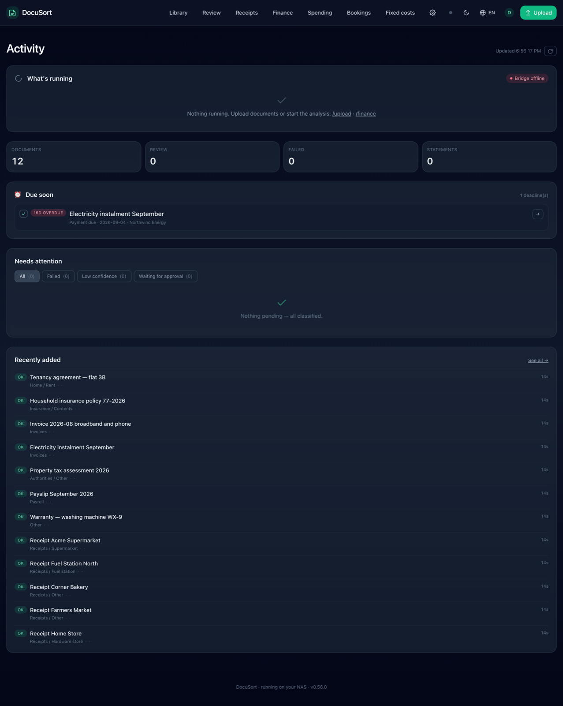

> ⚠️ **Written with AI.** This application was designed and written almost
> entirely by an AI assistant (Claude), working from the author's requirements
> and reviewed by a human before each release. Treat it accordingly: read the
> code before you trust it with anything important, keep backups, and check
> any number that matters to you against your own bank statement. It handles
> real money data — please verify, don't assume.

---

## What it does

### Documents
- **Watches a folder.** Anything dropped into `inbox/` (or uploaded through the
  web UI, or scanned from a phone) is picked up automatically.
- **Reads it.** OCR for scans and photos, text extraction for digital PDFs.
- **Files it.** An AI model assigns a category, a subcategory, a date, a sender
  and a subject, and explains *why* in one sentence. Files land in
  `library/<year>/<category>/<subcategory>/` with a readable name.
- **Remembers deadlines.** Payment and cancellation dates are pulled out of the
  text and land on a "due soon" list.
- **Full-text search** across everything, with a year tree, tag filters and a
  review queue for anything the model was unsure about.

### Receipts
- Till receipts are broken down **line by line** — every item, quantity, unit
  price and category.
- The receipts page shows what you buy, where, how often and for how much.
- **Every receipt says how it was paid**: found as a booking on one of your
  accounts, paid in cash, or still open because the statement for that day has
  not been imported yet. Cash receipts can be put into a category — that money
  appears nowhere in your bank data otherwise.

### Money
- **Import bank data**: CSV exports (Sparkasse, DKB, ING, Volksbank, comdirect,
  Commerzbank, Deutsche Bank, N26, Consorsbank) *and* statement PDFs, which are
  read deterministically and checked against the statement's own opening and
  closing balance.
- **One way in:** documents, statements and CSVs all go through the same upload
  page. DocuSort decides from the file type what belongs where.
- **Categories that learn.** Assign a category once and DocuSort remembers the
  payee. Every booking shows a badge saying where its category came from
  (by hand, learned rule, transfer, AI suggestion, built-in detection).
- **Transfers between your own accounts are recognised** and counted as neither
  income nor spending.
- **Fixed costs found automatically** — same payee, steady amount, steady
  rhythm — with a monthly and a yearly figure.
- **Salary month** instead of calendar month: the period runs from one salary
  to the next, which is how a household actually budgets.
- **Invoices are matched to the bookings that paid them** (amount to the cent,
  payee tokens, date window, assigned one-to-one closest-first).
- **Pick the accounts that count.** On the spending and the fixed-costs page
  a tick per account decides which ones every figure covers — one account on
  its own, or all but one. A line then names what is included, so a filtered
  total never reads as the full one.

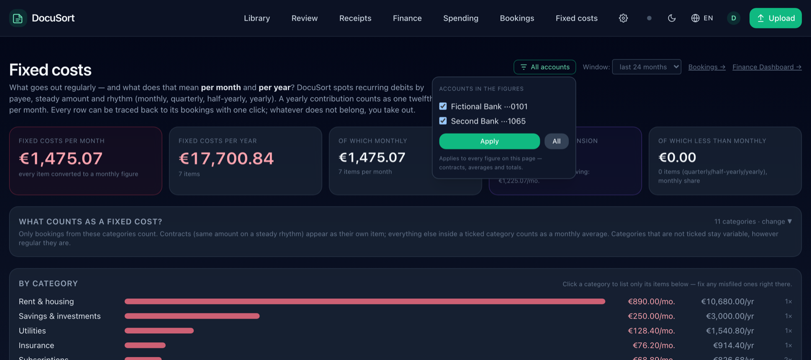

### The day view
The spending page draws **every day of the salary month** from its first
day: a bar per day with its amount on top, days without spending as what
they are, the days still to come as faint dots. One outlier runs off the
top instead of flattening everything else, a dashed line marks the average
and a second one how much a day may still cost.

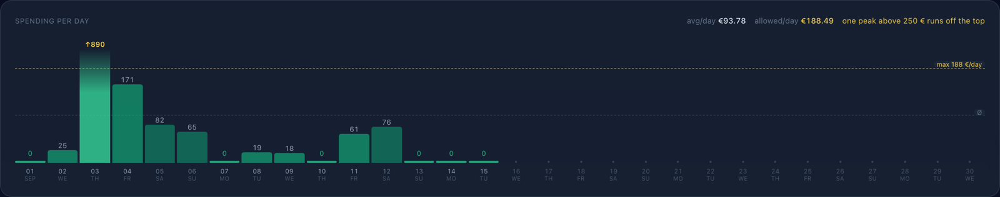

Point at a day and it says what it was; a day with no booking yet says so
rather than pretending you spent nothing.

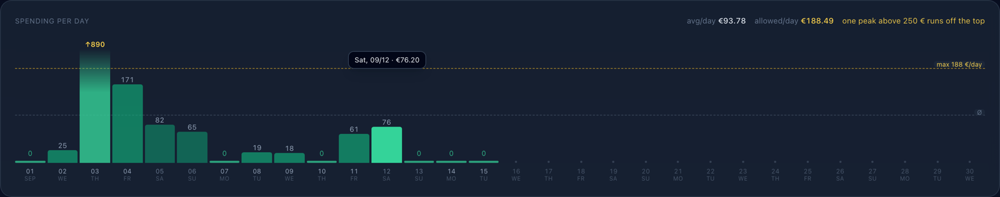

In the light theme:

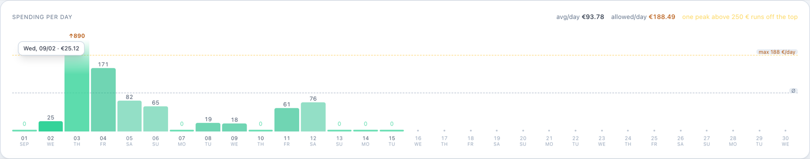

### The saving game
A gentle bit of gamification right below the chart: every day scores
points — a day without spending scores most, a day below your own
benchmark scores some — plus a bonus of up to 20 % when the period ends in
the black. Streaks, badges, five ranks, and a leaderboard across all
months so you can see which one actually went best.

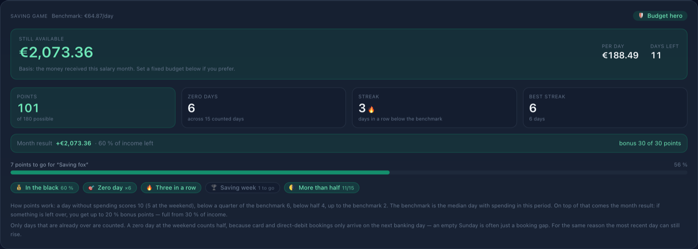

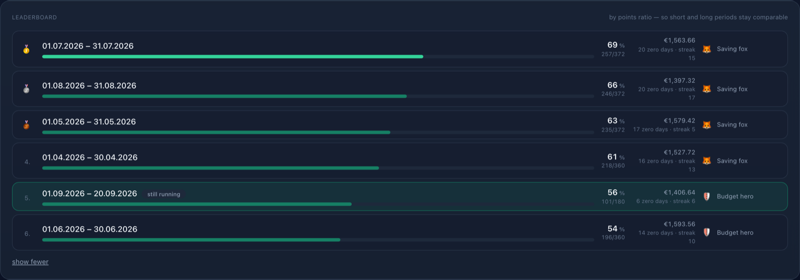

### On a phone

The phone view is built for the phone, not squeezed down from the desktop:
a tab bar within thumb reach, tables turned into readable rows, every
control at least 44 pixels tall, and filters that fold away instead of
standing in front of your data.

<table>
  <tr>
    <td width="33%"><a href="docs/screenshots/12-mobile-dashboard.png">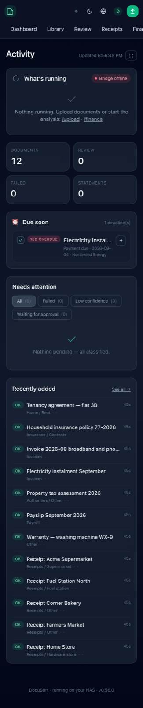</a></td>
    <td width="33%"><a href="docs/screenshots/25-mobile-menu.png">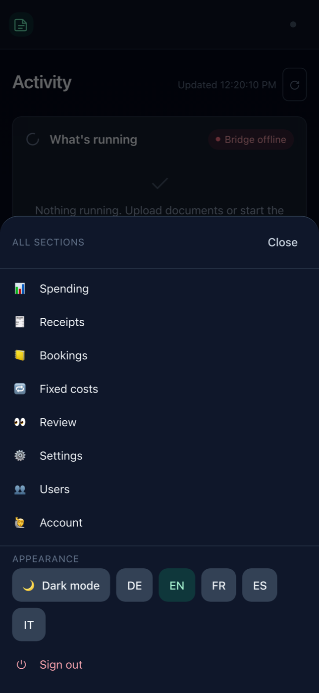</a></td>
    <td width="33%"><a href="docs/screenshots/22-mobile-bookings.png">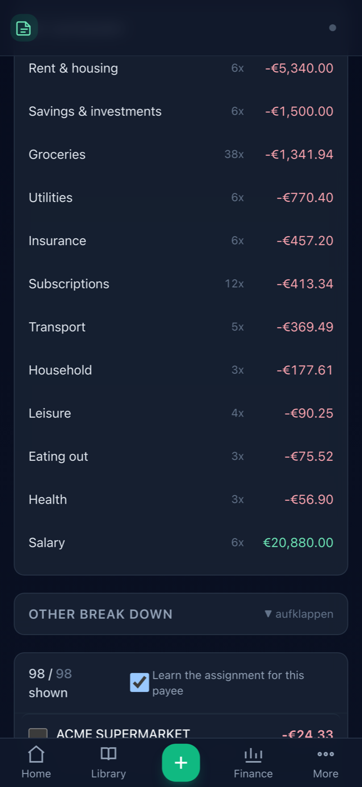</a></td>
  </tr>
  <tr>
    <td><a href="docs/screenshots/20-mobile-daily.png">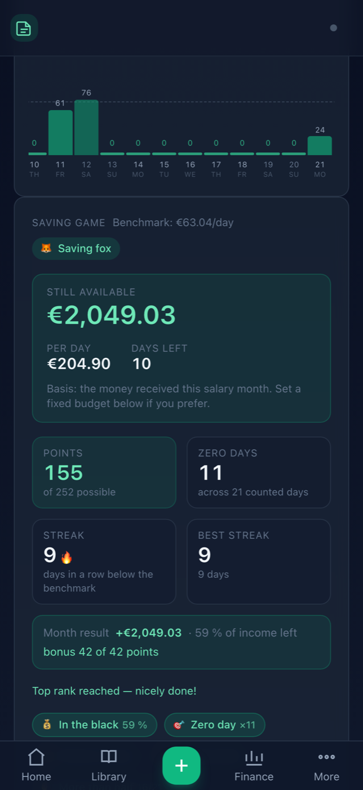</a></td>
    <td><a href="docs/screenshots/21-mobile-game.png">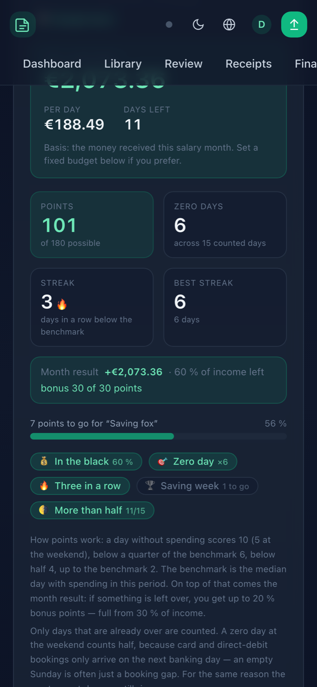</a></td>
    <td><a href="docs/screenshots/23-mobile-fixed.png">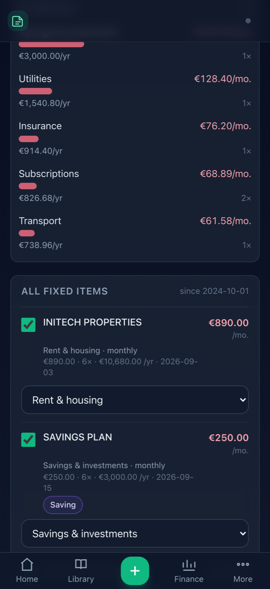</a></td>
  </tr>
</table>

<table>
  <tr>
    <td width="50%"><a href="docs/screenshots/03-spending.png">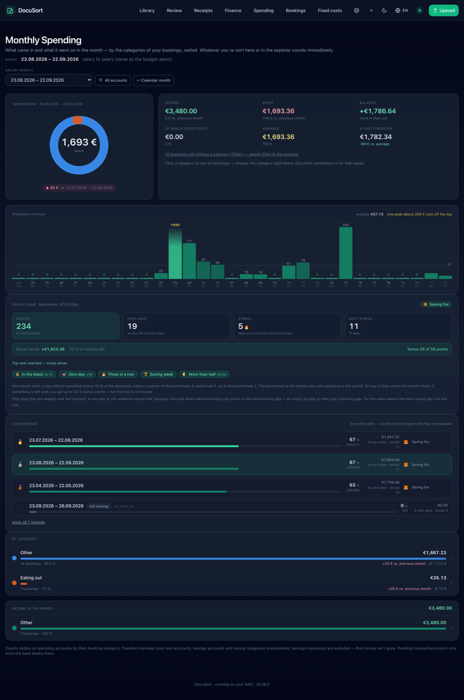</a></td>
    <td width="50%"><a href="docs/screenshots/05-receipts.png">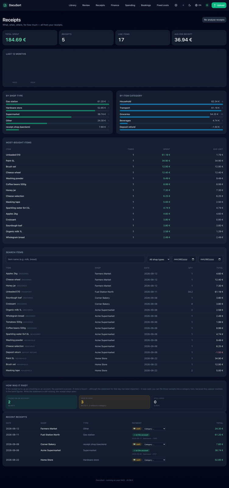</a></td>
  </tr>
  <tr>
    <td><a href="docs/screenshots/04-finance.png">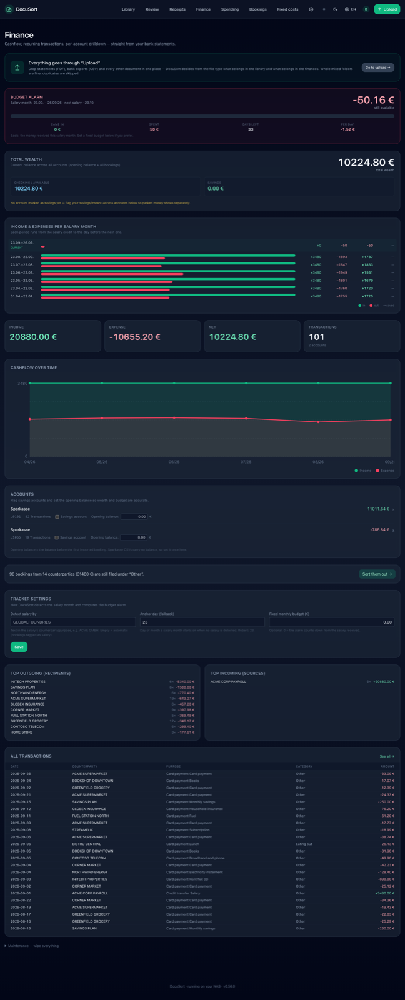</a></td>
    <td><a href="docs/screenshots/06-fixed-costs.png">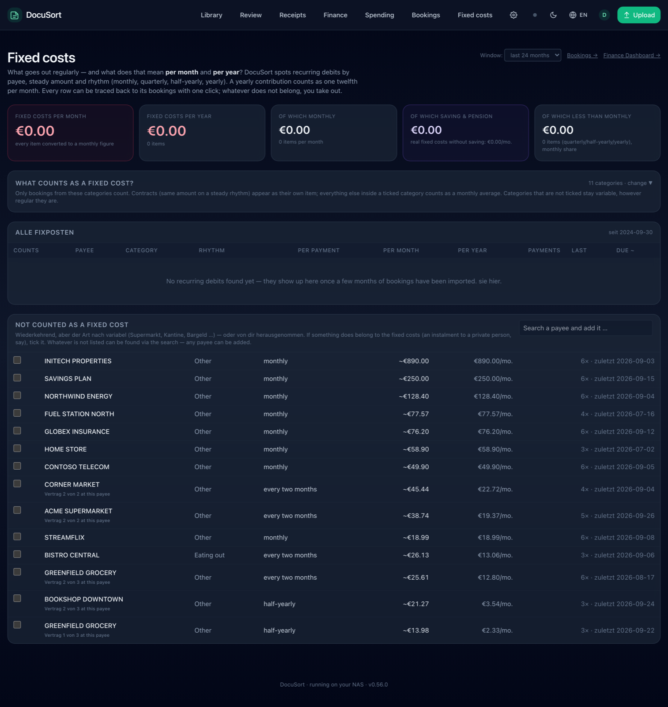</a></td>
  </tr>
  <tr>
    <td><a href="docs/screenshots/02-library.png">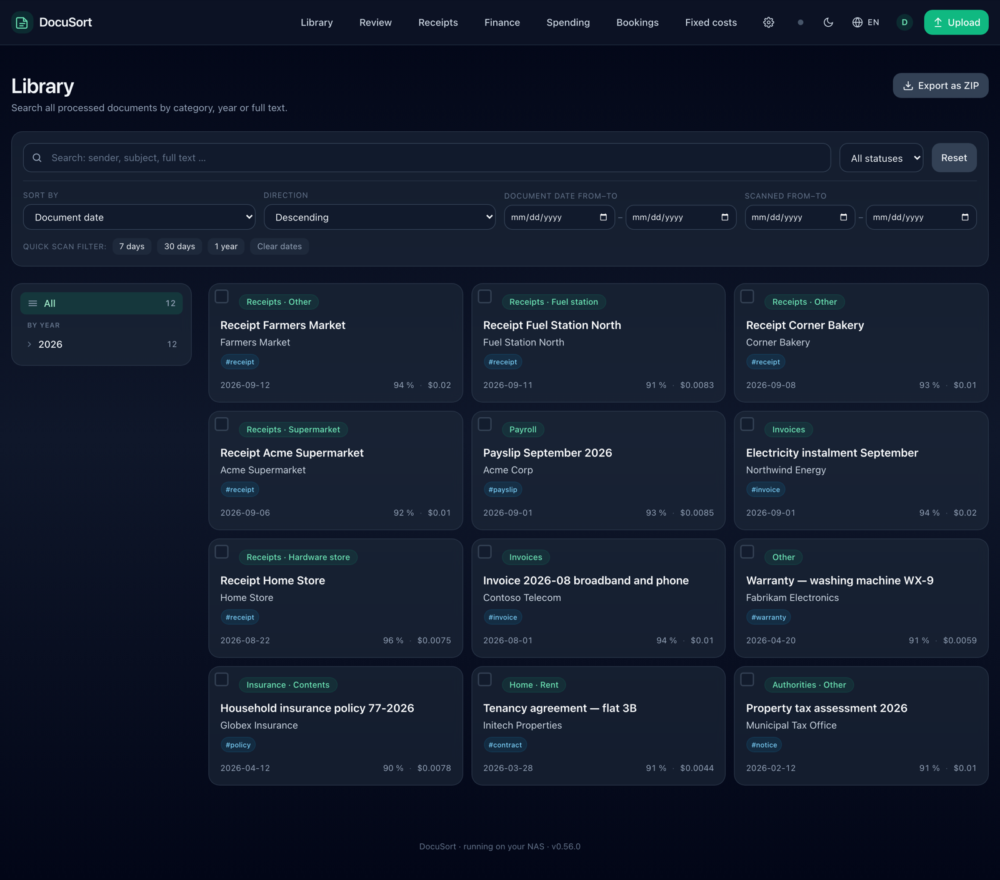</a></td>
    <td><a href="docs/screenshots/07-transactions.png">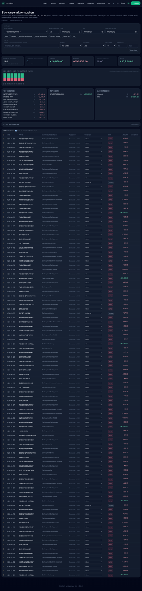</a></td>
  </tr>
</table>

*(Every screenshot on this page comes from a demo instance filled with invented
data — fictional shops, fictional employer, fictional bank.)*

### Everything else
- **Multi-user** with logins: admins may do everything, ordinary users may add
  documents but not delete them and cannot reach the settings.
- **Five languages** — English, German, French, Spanish, Italian — including
  numbers and dates in the local format.
- **Light and dark**, and the whole thing works on a phone.
- **Backups** to any rclone remote (iCloud, Google Drive, Dropbox, OneDrive,
  S3, …), scheduled or on demand.
- **Your choice of AI**: Anthropic Claude, OpenAI, Google Gemini, or anything
  that speaks the OpenAI API — including Ollama or LM Studio on your own
  machine, in which case nothing leaves your network at all. Setting that up
  is **one click**: DocuSort finds a local model by itself, and downloads a
  setup for the machine that hasn't got one. See below.

---

## Works with Postwache

<table>
<tr><td width="62%">

[**Postwache**](https://github.com/robeertm/Postwache) is the other half of the
same idea. It watches your **mailbox**: it sorts the noise out — newsletters,
adverts, delivery notices — and leaves what matters where you already look.

Most paper does not arrive on paper any more, it arrives as an attachment. So
the Postwache hands those straight to DocuSort: when mail comes in with a PDF,
the attachment goes through the ordinary `POST /upload` — the same front door a
browser uses, with its own service account you can switch off at any time.
Photos, calendar invitations and signature images stay out; anything that looks
like phishing is never handed on.

It can also search **backwards** through years of filed mail — *"every message
with a PDF from the tax office"* — and send the lot over in one go. Documents
already handed over are marked, so the same paper is never sent twice.

</td><td>

**Together**

```
  mailbox
     │
     ▼
 Postwache   ← noise out,
     │         documents found
     ▼
 DocuSort    ← filed, amount read,
     │         booking matched
     ▼
  answered
```

</td></tr>
</table>

## Install

### One command

```bash
curl -fsSL https://raw.githubusercontent.com/robeertm/DocuSort/main/deploy/install.sh | bash
```

The script checks that Docker is present, asks where your documents should
live, writes a `docker-compose.yml` and an `.env` next to it, pulls the image
and starts DocuSort on port 8080. Open `http://<host>:8080`, create the admin
account, add your AI key in Settings, and drop the first scan into the inbox.

### Docker Compose by hand

```yaml
services:
  docusort:
    image: ghcr.io/robeertm/docusort:latest
    container_name: docusort
    restart: unless-stopped
    ports:
      - "8080:8080"
    volumes:
      - ./data:/data            # inbox, library, database
      - ./config:/app/config    # config.yaml, categories.yaml
    environment:
      - TZ=Europe/Berlin
```

```bash
mkdir -p data/inbox config && docker compose up -d
```

### From source

```bash
git clone https://github.com/robeertm/DocuSort.git && cd REPO
python3 -m venv .venv && . .venv/bin/activate
pip install -r requirements.txt
python -m docusort            # http://localhost:8080
```

Python 3.11+ is required. For OCR install Tesseract (`apt install
tesseract-ocr tesseract-ocr-deu poppler-utils` or `brew install tesseract
poppler`).

---

## Updating

**Docker never re-pulls a running container.** `:latest` is a label, not a
subscription — pointing at it does not mean your container follows it. Until
you say so, DocuSort stays on the image you pulled.

```bash
cd <your docusort directory>
docker compose pull && docker compose up -d
```

Your documents, database and config live in the mounted volumes, so replacing
the image leaves them untouched.

### Having it done for you

`docker-compose.yml` ships a commented **Watchtower** block. Uncomment it and
new images are pulled on a daily schedule. Two things to weigh first:

* Watchtower needs the **Docker socket**, which is effectively root on the
  host. It is mounted read-only here, but it is still a privilege you are
  handing to a container.
* It updates on *its* schedule, which may be while you are mid-upload. The
  shipped schedule is nightly at 04:00 rather than hourly for that reason.

### Running from source

There the in-app updater applies: when a release is out, a banner offers
**Update now**, which fetches the release, swaps the code in place and
restarts the systemd service if one is installed.

🔴 **In a container that same button is refused, on purpose.** The code is part
of the image, so swapping files inside the container would be undone by the
next restart — you would see "updated", restart, and silently be back on the
old version. In a container the banner therefore shows the `docker compose`
command instead of a button.

## First run

1. **Create the admin account** — the first visit asks for it; nothing is
   reachable before that.
2. **Choose an AI provider** in *Settings*. Anthropic, OpenAI and Gemini need
   an API key; a local Ollama needs nothing at all — press *Find a model* and
   DocuSort looks for one (see *A local model, in one click* below).
3. **Check the categories.** `config/categories.yaml` is a plain list — rename,
   add and remove as you like. The descriptions are what the model reads, so
   write them in your own words. An English and a German taxonomy ship with the
   repository (`categories.yaml`, `categories.de.yaml`).
4. **Drop documents in.** Either into `data/inbox/` or through *Upload* — a
   whole folder at once is fine, mixed types included.
5. **Add your bank data** through the same upload page: a CSV export, a
   statement PDF, or both.

---

## A local model, in one click

A local model is the only setting where **nothing at all** leaves your house,
so DocuSort makes it the easy one. Two ways in, and both end in the same place.

**If you already run Ollama** — open *Settings* and press **Find a model**.
DocuSort looks where it can actually reach one: its own machine, its container
host, and the computer you have the settings page open on. Then it offers what
it found, with a usable model already picked — it skips embedding and vision
models, which cannot classify a document.

🔴 **It looks from the server's side, not from your browser's.** Your browser
sits on the machine where Ollama is installed; it would happily report
"reachable" while DocuSort — on a VM, in a container, on a NAS — cannot get
there at all. The question is never whether *you* can reach it.

There is no network scan here, and there never will be. Only addresses that
are already known get asked.

**If you haven't got Ollama yet** — download the setup for your system and
double-click it **on the machine the model should run on**, not on the one
running DocuSort. It installs Ollama (Homebrew / the official script /
winget), makes it listen where DocuSort can reach it, pulls a model, writes
the setting — and then asks **DocuSort** whether it works, rather than
reporting success from the machine it runs on. Finally it offers to restart
DocuSort so the classifier picks the model up.

The setup carries a **ticket** that is good for thirty minutes and for exactly
two things: writing that one setting and restarting the service. It is held in
memory, so it does not outlive the setup it belongs to.

⚠️ If the model ends up on a different machine than DocuSort, Ollama has to
listen on the network — and Ollama has no password, so anyone on that network
can then use it. The setup says so in plain words and asks first. On a single
machine none of this comes up.

`probe_local_ai.py` runs the whole path against a throwaway config and refuses
to pass if the ticket-guarded routes are anything other than exactly three, if
a missing or spent ticket is accepted, or if the generated launcher is wrong.

---

## Configuration

`config/config.yaml` carries the paths, the web settings, OCR, the AI provider
and the backup remote. Everything has a sensible default; the file is
commented throughout. The settings page writes the same values, so you rarely
need to edit it by hand.

Notable options:

| Key | What it does |
|---|---|
| `web.default_language` | `en`, `de`, `fr`, `es`, `it` — the browser's preference wins when it matches one of them |
| `web.ssl_cert` / `web.ssl_key` | serve HTTPS directly (a Tailscale certificate works nicely) |
| `ai.provider` | `anthropic`, `openai`, `gemini`, `openai_compat` (Ollama, LM Studio, …) |
| `ocr.enabled` | run OCR on scans and photos |
| `sync.remote` | an rclone remote for backups, e.g. `gdrive:DocuSort` |
| `finance.salary_match` | text that identifies your salary booking, for the salary month |

---

## Privacy

- **Documents never leave the machine.** Only extracted text goes to the AI
  provider you configured — and with a local model, not even that.
- **Bank data is processed locally.** Statement PDFs are parsed with a
  deterministic reader, not an AI, and checked against the statement's own
  balances.
- **Statements can be pseudonymised** before anything is stored.
- **No telemetry, no phone-home, no account.** The only outbound connections
  are the AI provider you chose, the rclone remote you configured, and an
  optional update check against GitHub.

---

## How it works

```
inbox/  →  watcher  →  OCR / text  →  AI classification  →  library/<year>/<category>/
                                           │
                            receipts → line items → Receipts page
                          statements → bookings  → Finance, Spending, Fixed costs
```

- **FastAPI + SQLite.** One file holds everything; back it up and you are done.
- **No build step for the frontend** — server-rendered HTML with Alpine.js and
  a precompiled Tailwind stylesheet.
- **Deterministic where it matters.** Balances, matching and the finance
  figures are plain code with tests, not model output. The AI is used for
  classification and for reading receipts.

---

## Contributing

Issues and pull requests are welcome. Please keep in mind that this is a
personal project built for one household first; features that only make sense
for a specific bank or country may be declined.

If you send a pull request that touches the interface, add the new strings to
all five language files (`docusort/locales/*.json`) — the key sets are
identical by design and a test checks that.

## Licence

**Source-available, not open source.** Read the code, run it for yourself,
change it for your own use — that is expressly allowed and always free. What
is not allowed is selling it, offering it as a service, or shipping it as part
of someone else's product. All rights stay with the authors.

GitHub does not recognise this as one of its standard licences, so the
sidebar shows none; the full terms are in [LICENSE](LICENSE).
